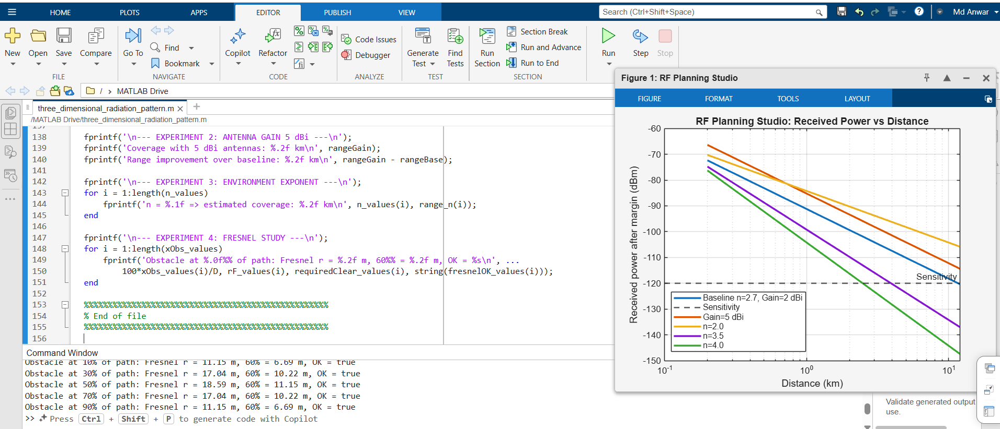

# RF Planning Studio – Wireless Link Feasibility

## Objective

The objective of this task is to evaluate a wireless link like an RF engineer. The simulation shows how design changes affect coverage distance, received power, Fresnel clearance, and link feasibility.

## Baseline Parameters

| Parameter | Value |
|---|---:|
| Frequency | 868 MHz |
| Link distance | 4 km |
| Transmit power | 14 dBm |
| Antenna gains | 2 dBi TX, 2 dBi RX |
| Gateway height | 20 m |
| Sensor height | 2 m |
| Environment exponent | n = 2.7 |
| Receiver sensitivity | -120 dBm |
| Fade margin | 10 dB |

## MATLAB Files

Submit this repository with:

- `rf_planning_studio.m`
- `README.md`
- one screenshot of the generated plot, for example `rf_planning_plot.png`

## Screenshot of Plot

Add your MATLAB plot screenshot here after running the script:

## Experiment 1 – Increase Gateway Height by +5 m

The gateway height was changed from 20 m to 25 m.

The maximum line-of-sight distance increases because the antenna is higher above the ground. In the script, the approximate LOS distance is calculated using:

`maxLOS = 3.57 * (sqrt(htx) + sqrt(hrx))`

For the baseline, the LOS distance is about 21.0 km. After increasing the gateway height to 25 m, it becomes about 22.9 km. The improvement is about 1.9 km.

However, the received power curve does not change much in this simplified model because the path-loss equation does not directly use antenna height. Height mainly improves geometry, visibility, and Fresnel clearance. Therefore, link feasibility improves, but not as strongly as changing path loss or antenna gain.

## Experiment 2 – Increase Antenna Gain to 5 dBi

The antenna gains were changed from 2 dBi to 5 dBi for both transmitter and receiver.

The received power curve moves upward because higher antenna gain increases the effective radiated power and also improves received signal collection. Since both sides were increased by 3 dB, the link budget improves by about 6 dB total.

This gives additional range because the received signal stays above the receiver sensitivity for a longer distance. Antenna gain extends coverage by focusing energy more effectively in the useful direction instead of spreading it equally everywhere.

## Experiment 3 – Change Environment Exponent

The tested values were:

- `n = 2.0`
- `n = 3.5`
- `n = 4.0`

Increasing the environment exponent reduces coverage strongly. A lower value such as `n = 2.0` represents near free-space conditions, so the signal decreases more slowly with distance. Higher values such as `n = 3.5` or `n = 4.0` represent more difficult environments with buildings, trees, terrain, and obstruction losses.

The environment exponent usually has a stronger impact on range than a small antenna gain increase. Antenna gain improves the link budget by a fixed number of dB, but the environment exponent changes how fast loss grows with distance. Physically, this means that terrain and obstacles can reduce coverage much more than a small hardware improvement can recover.

## Experiment 4 – Move Gateway Location / Fresnel Study

The obstacle position was tested at different points along the path, such as:

- `0.1D`
- `0.3D`
- `0.5D`
- `0.9D`

The Fresnel radius is largest near the midpoint of the link. This happens because the Fresnel radius depends on both distances from the obstacle to the transmitter and receiver. At the midpoint, both sides are large and balanced, so the Fresnel zone becomes widest.

The midpoint is usually critical because an obstacle there blocks a larger part of the Fresnel zone compared with an obstacle close to one antenna. If the 60% Fresnel clearance rule is violated, the signal may suffer diffraction loss, fading, and unstable link performance. Even if the received power looks acceptable in the link budget, poor Fresnel clearance can make the real link unreliable.

## Final Conclusion

In practical wireless deployment, the environment has the strongest impact on coverage. Antenna gain and transmit power can improve the link budget, but terrain, buildings, vegetation, and Fresnel blockage can quickly reduce the useful range. Increasing gateway height is also important because it improves line-of-sight and Fresnel clearance. For a real RF design, the best improvement is usually achieved by choosing a better antenna location and height first, then improving antenna gain if needed. A link is feasible only when received power, fade margin, and Fresnel clearance are all acceptable.

## How to Run

1. Open MATLAB.
2. Create or open `rf_planning_studio.m`.
3. Run the script.
4. Save the plot as `rf_planning_plot.png`.
5. Upload the `.m` file, README file, and screenshot to GitHub.
