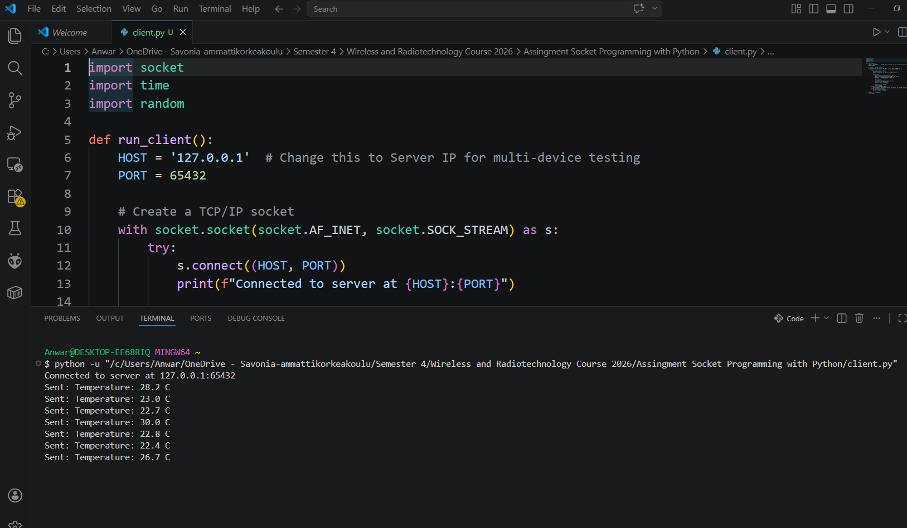

# Simple TCP Client-Server System

## Description
A Python-based networking project that demonstrates TCP communication. 
The client simulates an IoT sensor by sending random temperature data 
to a centralized server every 5 seconds.

## How to Run
1. **Start the Server**: 
   Open a terminal and run `python server.py`.
2. **Start the Client**: 
   Open a second terminal and run `python client.py`.

## Testing Results
### Localhost Test
- **Status**: Passed
- **Details**: Server and Client connected successfully on `127.0.0.1`. 
  Data was received and printed accurately.

### Second Device Test
- **Status**: Passed
- **Setup**: Server ran on Laptop A; Client ran on Laptop B (Hotspot).
- **Modification**: Updated `HOST` in `client.py` to Laptop A's local IP.

## Screenshot
